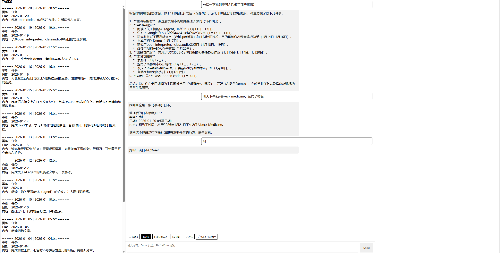

# AI 日志管理系统

<div align="center">



*自然对话，即可完成日志记录与智能管理*

</div>

---

## 📌 项目背景

在日常任务管理与记录中，信息分类、存储与整理往往花费大量时间。本项目通过 AI 解决这一问题：

- **用户只需输入一句话**，AI 自动判断日志类型（任务/反馈/事件/目标）并自动归档
- **后续查看便捷**：可直接浏览结构化日志，或通过与 AI 对话回顾历史
- **用户画像驱动**：AI 根据历史日志生成用户画像，在对话中了解用户现状与未来规划，提供更贴合上下文的服务

---

## 🎯 核心功能

| 功能 | 说明 |
|------|------|
| **智能分类** | 自动识别四种日志类型：任务、反馈、事件、目标 |
| **自动归档** | 根据类型自动保存到对应目录，文件名规范化 |
| **历史检索** | 开启 "Use History" 后，AI 自动关联相关历史日志 |
| **用户画像** | 异步生成并持续更新用户画像，作为长期上下文 |
| **派生视图** | 一键查看各类型日志的汇总视图 |

---

## 💬 使用交互逻辑

### 对话流程

```
┌─────────────────────────────────────────────────────────────┐
│                      用户输入一句话                          │
└─────────────────────────┬───────────────────────────────────┘
                          │
                          ▼
            ┌─────────────────────────────┐
            │   S1：意图判断 & 草稿生成     │
            │   （日志类型识别 + 草案输出）  │
            └─────────────┬───────────────┘
                          │
            ┌─────────────┴───────────────┐
            ▼                             ▼
     ┌─────────────┐               ┌─────────────┐
     │   是日志？   │               │  普通聊天？  │
     └──────┬──────┘               └──────┬──────┘
            │                             │
     ┌──────┴──────┐               ┌──────┴──────┐
     ▼             ▼               ▼             ▼
  确认/修改     放弃日志         正常回复      回到 S1
     │             │               │
     ▼             ▼               ▼
  ┌─────────────────────────────────────────────┐
  │              归档 → 触发派生文件              │
  └─────────────────────────────────────────────┘
```

### 日志类型定义

| 类型 | 定义 | 例子 |
|------|------|------|
| **任务 (Task)** | 今天或明天要做的事情 | 今天要看两篇论文；明天要看完一本书 |
| **反馈 (Feedback)** | 当天任务完成情况的反馈或单纯总结 | 今天论文只看了一篇；昨天书没看完 |
| **事件 (Event)** | 未来某天带日期/时间点的安排 | 1月5号考试；下周二面试 |
| **目标 (Goal)** | 中长期目标（跨天/跨周/跨月） | 这个月减肥5斤；本学期拿到A |

### 前端操作

| 操作 | 说明 |
|------|------|
| **输入内容 + Enter** | 发送消息 |
| **Shift + Enter** | 换行 |
| **☰ Logs** | 展开/收起左侧日志面板 |
| **TASK / FEEDBACK / EVENT / GOAL** | 快速查看对应类型的汇总日志 |
| **● Use History** | 开启后，当前对话会注入相关历史日志上下文 |

---

## 🏗️ 代码逻辑架构

```
┌──────────────────────────────────────────────────────────────────┐
│                         前端 (web/)                              │
│              index.html + app.js + style.css                     │
│                          ↓ HTTP                                  │
└──────────────────────────────────────────────────────────────────┘
                              │
                              ▼
┌──────────────────────────────────────────────────────────────────┐
│                      后端 (server/api.py)                        │
│                    FastAPI / 127.0.0.1:8000                      │
│   POST /api/chat          GET /api/derived/{log_type}            │
└──────────────────────────────────────────────────────────────────┘
                              │
                              ▼
┌──────────────────────────────────────────────────────────────────┐
│                   编排层 (orchestrator/run.py)                    │
│                         Orchestrator                             │
│  ┌─────────────────────────────────────────────────────────┐    │
│  │  S1：自由聊天 / 日志意图判断                              │    │
│  │      └── 调用 LLM (prompt1) → 判断类型 1-1/1-2           │    │
│  └─────────────────────────────────────────────────────────┘    │
│  ┌─────────────────────────────────────────────────────────┐    │
│  │  S2：日志确认阶段                                        │    │
│  │      └── 调用 LLM (prompt2) → 确认/修改/退出 2-1/2-2/2-3 │    │
│  └─────────────────────────────────────────────────────────┘    │
└──────────────────────────────────────────────────────────────────┘
                              │
          ┌───────────────────┼───────────────────┐
          ▼                   ▼                   ▼
   ┌────────────┐     ┌────────────┐      ┌────────────┐
   │  agent/    │     │  state/    │      │  derived/  │
   │  LLM 调用   │     │  状态管理   │      │  派生构建   │
   └────────────┘     └────────────┘      └────────────┘
```

### 核心模块职责

| 模块 | 路径 | 职责 |
|------|------|------|
| **launcher.py** | 项目根 | 启动入口：启动 FastAPI + 打开前端页面 |
| **server/api.py** | server/ | FastAPI 服务：/api/chat、/api/derived |
| **orchestrator/run.py** | orchestrator/ | 状态机编排：S1/S2 切换、日志保存触发 |
| **agent/llm.py** | agent/ | LLM 客户端封装 |
| **agent/prompt.py** | agent/ | 系统提示词（prompt1/prompt2/用户画像/日志路由） |
| **state/build_user_profile.py** | state/ | 从所有日志生成用户画像（每天一次） |
| **state/select_logs.py** | state/ | 根据当前输入检索相关历史日志 |
| **state/build_file_index.py** | state/ | 构建日志文件索引 |
| **derived/build_derived_logs.py** | derived/ | 生成各类型日志的汇总视图 |

### 数据流向

```
用户输入
    │
    ├─→ [判断是否日志]
    │       │
    │       ├─→ 是日志 ──→ S2 ──→ [确认/修改/退出]
    │       │                      │
    │       │               ┌──────┴──────┐
    │       │               ▼             ▼
    │       │        保存日志      放弃日志
    │       │               │
    │       │               ▼
    │       │        build_file_index()
    │       │        build_derived_logs()
    │       │        build_user_profile()
    │       │
    │       └─→ 普通聊天 ──→ 正常回复
    │
    └─→ [可选] useHistory 开启时
            │
            ▼
        select_relevant_logs()
            │
            ▼
        注入相关历史日志到上下文
```

---

## 🧠 智能体记忆思路

### 三层记忆结构

```
┌─────────────────────────────────────────────────────────────────┐
│                        LLM 上下文                               │
│  ┌─────────────────────────────────────────────────────────┐   │
│  │  当前对话历史 + 本轮用户输入 + 系统提示词                 │   │
│  └─────────────────────────────────────────────────────────┘   │
│                              ▲                                  │
│                              │                                  │
│  ┌─────────────────────────────────────────────────────────┐   │
│  │  用户画像 (state/user_profile.txt)                       │   │
│  │  - 领域与兴趣                                             │   │
│  │  - 任务执行模式                                           │   │
│  │  - 规划与时间性                                           │   │
│  │  - 项目驱动与问题解决                                      │   │
│  │  - 状态与习惯                                             │   │
│  │  - 记录与反思风格                                         │   │
│  └─────────────────────────────────────────────────────────┘   │
│                              ▲                                  │
│                              │                                  │
│  ┌─────────────────────────────────────────────────────────┐   │
│  │  历史日志 (storage/)                                     │   │
│  │  - tasks/  (按日期命名)                                   │   │
│  │  - feedback/ (按日期命名)                                 │   │
│  │  - events/  (事件+日期命名)                               │   │
│  │  - goals/   (目标+日期命名)                               │   │
│  └─────────────────────────────────────────────────────────┘   │
└─────────────────────────────────────────────────────────────────┘
```

### 记忆生成与更新

| 记忆类型 | 更新时机 | 生成方式 |
|----------|----------|----------|
| **用户画像** | 每天首次调用时 | LLM 分析全部历史日志 |
| **文件索引** | 保存日志后 | 扫描 storage 目录 |
| **派生日志** | 保存日志后 | 按类型汇总写入 derived/ |

### 用户画像示例

> **【用户画像】**
> 
> - 领域与兴趣：深度聚焦于人工智能（AI）领域，尤其关注智能体（Agent）、语音处理、AI 工具开发
> - 任务执行模式：习惯制定每日任务清单，存在任务延期或未完成的情况
> - 规划与时间性：具备中长期规划意识，日常任务安排灵活
> - 项目驱动与问题解决：学习与研究常以具体项目或问题为牵引
> - 当前轮廓：一名积极在 AI 技术领域进行探索与实践的研究者/学生

---

## 💭 对话思路

### 状态机设计

| 状态 | 触发条件 | LLM Prompt | 可能输出 |
|------|----------|------------|----------|
| **S1** | 初始状态或日志结束后 | `prompt1` + 当前输入 | `1-1` (日志草案) / `1-2` (普通回复) |
| **S2** | 用户确认写日志 | `prompt2` + 草稿 + 用户回复 | `2-1` (确认保存) / `2-2` (修改草稿) / `2-3` (跳出日志) |

### Prompt 设计原则

1. **单阶段原则**：每轮只做一件事，避免跨阶段假设
2. **严格 JSON 输出**：保证解析可靠性
3. **禁止自我假设**：不假设用户已确认
4. **禁止提前保存**：只生成草案，结果由调用方保存

### 历史日志注入机制

```
用户输入 (前缀 -)
        │
        ▼
select_relevant_logs(user_input)
        │
        ├─→ 读取 user_profile.txt
        ├─→ 读取 file_index.json
        ├─→ 调用 LLM (prompt_file_router)
        └─→ 返回相关日志文本
        │
        ▼
注入到 S1/S2 的上下文
```

---

## 📂 目录结构

```
AI日志管理-前后端/
├── agent/                   # LLM 相关
│   ├── llm.py              # LLM 客户端
│   ├── llmdraft.py
│   └── prompt.py           # 系统提示词集合
├── orchestrator/            # 编排层
│   └── run.py              # Orchestrator 状态机
├── server/                  # FastAPI 后端
│   └── api.py              # API 路由
├── schema/                  # 数据协议
│   ├── response.py         # JSON 解析与 XML 包装
│   └── rules.md            # 内部规范
├── state/                   # 状态管理
│   ├── build_user_profile.py
│   ├── build_file_index.py
│   ├── select_logs.py
│   ├── file_index.json     # 索引缓存
│   └── user_profile.txt    # 用户画像
├── derived/                 # 派生文件
│   ├── events.txt          # 事件汇总
│   ├── feedback.txt        # 反馈汇总
│   ├── goals.txt           # 目标汇总
│   └── tasks.txt           # 任务汇总
├── storage/                 # 原始日志
│   ├── events/
│   ├── feedback/
│   ├── goals/
│   └── tasks/
├── web/                     # 前端
│   ├── index.html          # 主页面
│   ├── app.js              # 交互逻辑
│   └── style.css           # 样式
├── launcher.py             # 启动入口
├── app_paths.py            # 路径锚定
├── DemoApp.spec            # PyInstaller 配置
└── README.md               # 本文档
```

---

## 🚀 启动方式

### 开发模式

```bash
# 1. 启动后端
python -m uvicorn server.api:app --host 127.0.0.1 --port 8000

# 2. 打开前端
# 直接在浏览器打开 web/index.html
# 或使用浏览器打开 http://127.0.0.1:8000/docs 查看 API 文档
```

### 打包运行 (Windows)

```bash
# 1. 安装 PyInstaller
pip install pyinstaller

# 2. 打包
pyinstaller DemoApp.spec

# 3. 运行
dist/DemoApp/DemoApp.exe
```

---

## ⚙️ 配置说明

| 配置项 | 说明 |
|--------|------|
| **API_BASE** | `http://127.0.0.1:8000` (前端 hardcode) |
| **LLM_ENDPOINT** | `agent/llm.py` 中配置 |
| **LOG_DIR** | `storage/` 目录 |
| **DERIVED_DIR** | `derived/` 目录 |

---

## 📝 更新日志

### v1.1 (当前版本)
- 新增用户画像生成与持久化
- 新增历史日志检索功能 (Use History)
- 优化前端交互体验
- 完善日志类型判断逻辑

### v1.0
- 基础日志记录与分类功能
- FastAPI + 前端架构
- 四类日志自动归档

---

## 🔮 未来方向

- [ ] 支持多轮对话历史持久化
- [ ] 日志搜索与标签系统
- [ ] 数据导出功能
- [ ] 移动端适配

---

<div align="center">

**AI 日志管理系统** — 让记录更智能，让回忆更简单

</div>
